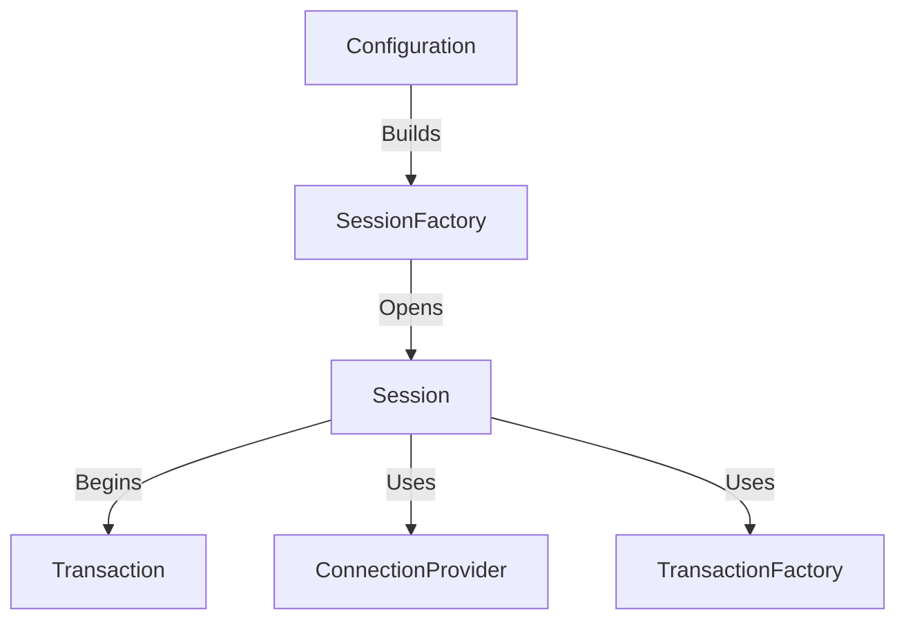

# Objectives & Hands-on Explanations

This document covers the theoretical objectives, architecture explanation, and walkthroughs for the Hibernate and Spring Data JPA concepts.

---

## Objective 1: Explain the Need and Benefit of ORM

### The Need for ORM (Object-Relational Mapping)
In object-oriented programming (Java), data is represented as an interconnected graph of objects (domain model). In relational databases (MySQL/PostgreSQL), data is represented in tabular format (tables, columns, and rows). 

This difference in representation is known as the **Object-Relational Impedance Mismatch**. Translating between these two formats using plain JDBC requires writing tedious, repetitive, and error-prone boilerplate code (mapping `ResultSet` to Java objects, writing manual SQL inserts/updates, and managing connection lifecycles).

### Benefits of ORM
*   **Abstraction of SQL:** Devs interact with database tables using Java objects instead of raw SQL strings.
*   **Database Independence:** The ORM translation engine generates SQL dialect matching the underlying database (e.g., MySQL, Oracle, H2), making database migrations easy.
*   **Transaction Management:** ORM frameworks handle transactional boundaries and connection pooling transparently.
*   **Performance Optimization:** Built-in mechanisms like first-level and second-level caching, lazy loading, and batch fetching improve application latency.
*   **Automatic DDL/Schema Generation:** Generates database schemas directly from Java classes.

---

## Objective 2: Core Objects of Hibernate Framework

Hibernate architecture consists of several core objects that manage the persistence lifecycle:



1.  **Configuration:** Reads configuration properties (`hibernate.cfg.xml` or properties files) and bootstrap metadata to create a `SessionFactory`.
2.  **SessionFactory:** A thread-safe, heavyweight factory object used to obtain `Session` instances. Usually created once per application lifecycle.
3.  **Session:** A lightweight, non-thread-safe object representing a single conversation/connection between the application and the database. It wraps a JDBC connection and serves as the entry point for CRUD operations.
4.  **Transaction:** A single-threaded, short-lived object used to define atomic units of work. It abstracts the underlying JDBC or JTA transaction implementation.
5.  **ConnectionProvider:** A factory for JDBC connections. It abstracts the datasource configuration and connection pooling.
6.  **TransactionFactory:** A factory for creating transaction instances.

---

## Objective 3: Hibernate XML Configuration vs. Annotation Configuration

### 1. XML Configuration (Hands-on 2)
In the traditional Hibernate XML configuration model, mappings between Java classes and database tables are defined in XML files:

*   **Configuration File (`hibernate.cfg.xml`):** Defines connection settings, dialect, and registers mapping files.
*   **Mapping File (`Employee.hbm.xml`):** Maps class attributes to columns:
    ```xml
    <hibernate-mapping>
       <class name="Employee" table="EMPLOYEE">
          <id name="id" type="int" column="id">
             <generator class="native"/>
          </id>
          <property name="firstName" column="first_name" type="string"/>
          <property name="lastName" column="last_name" type="string"/>
       </class>
    </hibernate-mapping>
    ```
*   **Usage Flow:**
    1. Build `SessionFactory` via configuration.
    2. Open a `Session` (`factory.openSession()`).
    3. Begin a transaction (`session.beginTransaction()`).
    4. Perform operations: `session.save()`, `session.get()`, `session.delete()`.
    5. Commit the transaction (`tx.commit()`) and close the session.

### 2. Annotation Configuration (Hands-on 3)
Modern Hibernate utilizes Java annotations directly in the model class to define mappings, eliminating the need for `.hbm.xml` files.

*   **Core JPA/Hibernate Annotations:**
    *   `@Entity`: Specifies that the class is mapped to a database table.
    *   `@Table`: Defines the table name.
    *   `@Id`: Denotes the primary key attribute.
    *   `@GeneratedValue`: Specifies primary key generation strategy.
    *   `@Column`: Maps the field to a specific database column name.

---

## Objective 4: Difference between JPA, Hibernate, and Spring Data JPA (Hands-on 4)

| Feature | JPA (Java Persistence API) | Hibernate | Spring Data JPA |
| :--- | :--- | :--- | :--- |
| **What is it?** | A specification (standard API) defined by JSRs. | An ORM framework that implements JPA. | An abstraction layer built on top of JPA providers. |
| **Implementation**| None. It is only an interface and set of annotations. | Concrete library providing the actual mapping logic. | Does not provide ORM itself; delegates to Hibernate. |
| **Goal** | Standardize persistence interfaces in Java. | Map objects to tables and generate SQL. | Eliminate boilerplate code (e.g. repositories, queries). |
| **Typical Code** | `javax.persistence.EntityManager` | `org.hibernate.Session` | `JpaRepository<Entity, Id>` |

---

## Objective 5: Hibernate Table Creation Configuration (`ddl-auto`)

The `spring.jpa.hibernate.ddl-auto` setting configures how Hibernate updates the database schema on startup:

*   `create`: Drops existing tables, data, and constraints, then creates fresh tables from entity classes.
*   `validate`: Checks if the tables and columns match the entity classes. Throws an exception on mismatch. (Safest for production).
*   `update`: Modifies the schema to match the entity definition (adds missing tables/columns). Does not delete existing columns.
*   `create-drop`: Creates schema on startup and drops it when the application shuts down.

---

## Objective 6: Spring Data JPA Query Methods Feature

Query Methods allow defining repository query methods by declaring their method signatures. Spring Data JPA parses the method name and automatically generates the query.

### Common Naming Patterns and Keywords:
*   **Containing:** Find values containing a string. E.g. `findByNameContaining(String text)`.
*   **StartingWith:** Find values starting with a prefix. E.g. `findByNameStartingWith(String prefix)`.
*   **OrderBy:** Sort the query results. E.g. `findByNameContainingOrderByNameAsc(String text)`.
*   **Between:** Find records between dates or numbers. E.g. `findByCodeAndDateBetween(String code, Date start, Date end)`.
*   **GreaterThan / LessThan:** Filter by numeric comparisons. E.g. `findByCodeAndCloseGreaterThan(String code, BigDecimal price)`.
*   **Top / First:** Limit the result count. E.g. `findTop3ByOrderByVolumeDesc()`.

---

## Objective 7: Hibernate O/R Relationships

ORM relationships define association mappings between different entity classes:

### 1. Many-to-One (`@ManyToOne`)
Maps a direct child-to-parent association where multiple child entities reference a single parent entity.
*   `@JoinColumn`: Declares the foreign key column mapping name in the child table.
*   **Fetch Type:** EAGER by default.

### 2. One-to-Many (`@OneToMany`)
Maps a parent-to-children association. 
*   `mappedBy`: Placed on the parent side to indicate that the relationship is owned by the field defined on the child side. This prevents the generation of an unnecessary join table.
*   **Fetch Type:** LAZY by default. If we need collection elements to load instantly, we set `fetch = FetchType.EAGER`.

### 3. Many-to-Many (`@ManyToMany`)
Maps a bidirectional or unidirectional many-to-many relationship using a join table.
*   `@JoinTable`: Configures the join table name and join columns (`joinColumns` for owning side, `inverseJoinColumns` for inverse side).
*   `mappedBy`: Placed on the non-owning side to reference the collection field in the owning entity.

